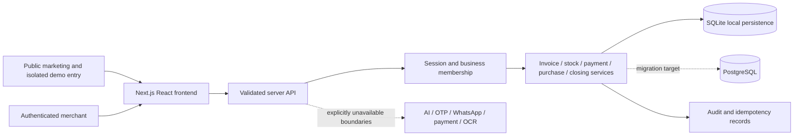

# DukaanSet application architecture

Architecture decision record · 8 October 2026. Distinguishes the first implementation's concrete storage/contract choices from target commercial architecture. This document is not a security certification or production-readiness claim.

Contract alignment review: 9 October 2026. Current public DTOs distinguish historical records from active balances and provide structured task context for localization. Stock/expense UI retries now use stable attempt keys; production session cookies always carry Secure.

## Selected architecture and decisions

| Decision | Current implementation direction | Rationale and release implication |
| --- | --- | --- |
| Web framework | Next.js App Router, React, TypeScript | Public SEO and private application share components while retaining separate data/indexing rules |
| Backend | Node server routes with typed validation and modular domain services | Financial authority remains on the server; no frontend totals are trusted |
| Initial persistence | Node native SQLite, local database path | A credential-free, durable local vertical slice; requires supported Node runtime and writable persistent disk |
| Production persistence | PostgreSQL adapter and versioned migrations | Required before a scalable multi-process commercial deployment; SQLite-local delivery is an explicit deviation from the preferred target stack |
| Numeric representation | Integer money in paise and quantity in thousandths | Avoids binary floating-point arithmetic in authoritative amounts |
| Integration policy | Explicit provider boundaries, unavailable until implemented and configured | No fake AI, payment, SMS/OTP, banking or government e-invoice result |
| Application composition | Shared category configuration and shared ledger services | One business platform, rather than six duplicated apps |

Next.js route handlers are the initial API host. Keep domain functions independent enough to move behind a dedicated API service without rewriting financial rules. Split the backend into catalog/inventory, invoicing, payments, purchases, closing, reporting and access services as scope grows. The first slice may group closely related transactional functions in a domain module; that does not justify business logic in page components.

## Source organization

- `src/app`: public pages, authentication, private route shell and API handlers.
- `src/components`: shared identity, marketing and application components.
- `src/lib/contracts.ts`: shared public DTOs and language/category identifiers.
- `src/lib/server/schema.ts`: initial SQLite schema version 1.
- `src/lib/server/validation.ts`: accepted inputs and decimal/unit conversion validation.
- `src/lib/server/store.ts`: persistent storage access and transactional business operations.
- `src/lib/server/router.ts`: HTTP validation, origin checks, bounded request bodies and routing.
- `src/lib/server/auth.ts`: server-rendered session lookup for protected pages.
- `public`: centralized original logos/icons/manifest assets.
- `tests`: financial, access, integration and browser checks.
- `docs`: requirements, research, roadmap, architecture and delivery evidence.

File organization can evolve while retaining these responsibilities. Maintain server-only boundaries so database handles and secrets cannot be bundled into client code.

## Implemented-schema foundation and known limits

Schema version 1 currently declares these core tables. This is a schema description, not proof all corresponding UI/API flows are complete.

| Entity | Key relationships and constraints | Important limit / target extension |
| --- | --- | --- |
| `users` | Unique email, hash, language and demo indicator | Verification, recovery, deletion and retention later |
| `businesses`, `memberships` | Membership composite key `(user_id,business_id)` with role | First slice owner-only; staff invites and granular capabilities later |
| `sessions` | Hash of session token linked to user; expiry | Persistent session revocation and production rate-limit infrastructure must be verified |
| `products` | Business owner; nonnegative paise/milli fields; unique nonempty tenant SKU | Product expiry field is not a batch ledger; variants, serials and status lifecycle later |
| `customers`, `suppliers` | Business owner and contact fields | No independent editable balance; history/allocations determine due amounts |
| `invoices` | Tenant invoice number uniqueness; customer reference; total = paid + balance | Version 1 line items are JSON snapshots, not normalized invoice-item rows |
| `payments` | Tenant, optional customer/invoice, amount > 0, method and kind | Oldest-first multi-invoice repayment creates one record per allocation; payment grouping/manual allocation and supplier-payment entities are target extensions |
| `movements` | Tenant/product, signed quantity, reason and reference | Extend structured references and valuation/batches in later migrations |
| `purchases` | Tenant/supplier and monetary consistency | JSON line snapshots; record represents received stock, with paid amount treated as cash; separate payment-method/supplier-payment ledger later |
| `expenses` | Tenant, description, positive amount, method/date | Categories, approval and receipts later |
| `closings` | One per tenant/business day; recorded expected/actual/difference | Current-day financial writes guarded once closed; controlled reopen, historical period protection and cash-adjustment ledger later |
| `audit` | Tenant/actor, action, detail and date | Retention, sensitive-data minimization and operational audit access must be reviewed |
| `idempotency` | Composite `(business_id,operation,key)` plus fingerprint and result | Define retention and replay semantics; all financial operations need coverage |

Existing indexes cover business/date invoice and payment reads, membership lookup, tenant products, movements and audit. New workloads need query plans and indexes, not blanket claims of scale. Cross-tenant foreign relationships require application validation now; a later migration should strengthen this with tenant-qualified composite foreign keys where feasible.

Version 1's JSON invoice and purchase line snapshots preserve historical display values but limit relational analysis and constraints. Normalize line items and payment allocations before sophisticated reporting, manually selected/grouped multi-invoice settlements, partial returns and PostgreSQL migration. Run a real forward migration preserving IDs and historic amounts; do not recreate a live database to add fields.

## Request and authorization boundary

Protected flow:

1. Validate session token and expiry; resolve authenticated user on the server.
2. Validate selected business membership for that user.
3. Authorize the operation's role/capability and future plan entitlement.
4. Validate input shape, integer bounds, related record ownership and lifecycle state.
5. Execute the transaction and append audit records.
6. Return DTOs scoped to the selected business with safe errors.

Never rely on a business selector, guessed UUID difficulty, hidden navigation or a client-supplied role. Every business-owned query includes the business scope. Product/customer/supplier/invoice IDs referenced in a write are checked in that same tenant. The AI/export/document boundaries repeat these checks.

Mutation requests need origin/CSRF defense appropriate to cookie authentication, secure cookie attributes, controlled error logging and safe headers. Password hashes and tokens must never appear in DTOs. Role names in a schema are not an implemented permission system; owner-only delivery must be described honestly.

Current code uses per-password salted `scrypt`, constant-time hash comparison, random 32-byte session tokens stored as SHA-256 hashes, seven-day expiry, HttpOnly/SameSite=Lax cookies and Secure for every production response or HTTPS URL. Production HTTP sessions are unsupported. API mutations require matching Origin and reject cross-site fetches. JSON bodies are limited to 64KB and responses use no-store. Rate-limit buckets are process-local; distributed abuse controls and final ingress/origin behavior remain production review work. These are implementation observations, not a complete security assessment.

Origin validation uses the validated incoming HTTP Host, because Next normalizes loopback URLs; forwarded-host headers are ignored. A deployed trusted ingress must restrict public hosts, preserve the approved Host and present the correct HTTPS scheme. `NEXT_PUBLIC_SITE_URL` is public metadata configuration, not an origin allowlist. See [the server security boundary](../src/lib/server/SECURITY.md) and [deployment preparation](deployment.md).

### Initial API surface

| Method/path | Contract |
| --- | --- |
| `POST /api/auth/register`, `/login`, `/demo`, `/logout` | Real local account/session or deliberately isolated fictional demo |
| `GET /api/session` | Current safe user DTO and authorized businesses |
| `POST /api/account/language` | Persist user display language |
| `POST /api/businesses` | Add another owner business |
| `GET /api/businesses/:businessId/state` | Tenant-scoped dashboard/catalog/financial DTO aggregate |
| `POST /api/businesses/:businessId/products`, `/customers`, `/suppliers`, `/stock` | Validated catalog/contact creation or reasoned stock adjustment |
| `POST /api/businesses/:businessId/invoices`, `/payments`, `/purchases`, `/expenses`, `/closing` | Authoritative financial operations and closing |
| `POST /api/businesses/:businessId/invoices/:invoiceId/cancel` | Guarded full reversal |
| `GET /api/businesses/:businessId/export` | Authorized business JSON export, excluding credentials |
| `GET/POST /api/businesses/:businessId/ai` | Explicit unavailable response until real assistant adapter exists |

The aggregate state endpoint is suited to the bounded local slice. Split paginated catalog/history/report queries as datasets grow; response truncation must never silently corrupt financial totals. Detail routes may derive an invoice from authorized state until dedicated record endpoints are introduced.

### Financial and task DTO semantics

- Raw database payment `amount_paise` is a positive magnitude with a `kind`. Public `Payment.amountPaise` is signed: sale/repayment positive, refund negative. Frontend collection totals sum the signed DTO amounts; they must not negate refunds a second time. Raw JSON exports retain the database magnitude/kind representation and must state this distinction to consumers.
- A cancelled invoice retains original total and line values for history. Its public DTO has current `paidPaise = 0` and `balancePaise = 0`; raw historical columns are preserved. Do not apply the active-invoice equation to a cancelled invoice or show its old balance as collectible.
- `Closing.date` is an ISO event timestamp. `Closing.businessDay` is the Asia/Kolkata calendar date used for selecting the day's closing; comparing a timestamp directly to a date-only string is invalid.
- Tasks include `type`, merchant-entered `name`, relevant product/customer ID, and structured quantity/unit, balance or expiry fields. Localized views should format those fields through translation templates and link to the exact record/task. Server English `title`/`detail` fallbacks do not prove complete Hindi/Hinglish coverage.

Invoice/payment/purchase confirmation has backend idempotency protection. Stock adjustment and expense creation now also accept `idempotencyKey` and use the same atomic fingerprint/result replay mechanism when supplied; their UI sheets retain one attempt key across retries. Identical replay returns the prior result without another stock movement, expense or audit record, including an expense replay after closing. For compatibility, stock/expense API callers may still omit the key and receive a plain transaction; such keyless retries cannot promise duplicate suppression. Require a stable unique key per logical attempt in any new client. Changed payload with a reused key is rejected. A disabled submit button is not an idempotency guarantee.

## Money and quantity contract

Public DTOs use `pricePaise`, `costPaise`, `totalPaise`, `balancePaise` and `quantityMilli`. Accept validated decimal strings at input, convert once, and retain integer amounts throughout calculation/persistence. Do not call `parseFloat` and round repeatedly across components.

Canonical product quantities are thousandths of their stored unit: `quantityMilli = 500` means 0.500kg for a kg product, 0.500m for a metre product, or fractional pieces only if the unit policy permits it. A future unit-conversion service needs exact rational conversion factors and unit dimensions; merely changing the displayed unit cannot change the stock basis.

`linePaise = roundHalfUp(pricePaise × quantityMilli / 1000)`. For positive integers this can be computed using integer quotient/remainder or checked `BigInt` intermediates. Validate both input bounds and multiplication safety, rejecting non-safe integer intermediates. Sum line paise, validate discount ≤ subtotal and apply the documented rounding point. Example: ₹80/kg × 0.500kg = ₹40 = 4,000 paise.

Business dates use **Asia/Kolkata** for the initial Indian-market slice; stored event timestamps use UTC. Date-only due/expiry/business-day values retain calendar semantics rather than being shifted by the browser timezone. Future configurable business timezone requires a tested migration/aggregation contract.

## Transaction boundaries and projections

### Sale confirmation

Within one write transaction: verify membership/references → resolve product snapshots and available stock → calculate totals → reserve sequential invoice identity → insert invoice and items → insert received payment → append sale movements → update quantity projection → append audit → save idempotent result → commit.

SQLite write transactions serialize the read/validate/update stock sequence. Configure a busy timeout and handle lock contention with actionable errors. Duplicate product lines must be rejected or aggregated before validating total requested quantity. If any validation or write fails, rollback everything.

For a repeat financial request, `(business,operation,key)` identifies an attempt. Same key + same canonical payload returns the original result. Same key + changed payload fails. Check fingerprint and reservation atomically; a frontend disabled button is insufficient protection.

### Repayment

Validate customer scope, active unpaid invoices and amount remaining → allocate oldest-first → append one payment record per invoice allocation → update bill state → audit → save idempotent result → commit. Manual allocation, a parent payment grouping and unallocated customer credit are target extensions. Do not overwrite customer balance by hand.

### Receipt and adjustment

A confirmed goods receipt saves supplier purchase, cost snapshots, paid amount, positive stock movements and quantity updates together. In the first slice its paid amount is cash-only and directly deducted by closing; it is not a general supplier-payment ledger. Order proposals never increase stock. A correction/waste movement records reason/actor and validates resulting nonnegative quantity. Returns/cancellation append inverse movements referring to originals.

### Full cancellation

Use a state transition guarded inside the transaction. Preserve original invoice identity and historical amounts, append inverse stock and original-payment refund records, mark cancelled and exclude it from active dues/sales. A repeated cancellation cannot reverse anything twice. The current code refuses bills with later repayments instead of guessing their refund attribution. Define reviewed repayment/credit-note allocation before extending this to partial returns; do not reuse full cancellation blindly.

### Daily closing

Derive the drawer expectation from cash collections/refunds, cash expenses and paid purchases. Persist date, opening/expected/actual cash and difference. Exclude UPI collections from cash. Current-day invoices, repayments, purchases, expenses and cancellation are guarded once the day is closed. Controlled reopening and protection of historical accounting periods remain future work; the guard checks the current business day, not a complete historical period-lock model.

### Derived views

Dashboard, tasks, outstanding balances, weekly sales and recent activity are server-derived projections. Sales exclude cancelled invoices according to the documented report definition. Collections distinguish sale receipts, old-dues receipts and refunds. Stock value based on entered cost is an estimate unless a tested valuation policy exists. Cached financial projections need tenant-scoped keys and explicit invalidation after every write/business switch.

## Configuration and localization

Category configuration controls units, dashboard priorities, suggested actions and visible capabilities. Billing/stock/customer services remain shared. Future `business_modules` overrides and server entitlements must be enforced independently of UI hiding.

User language uses `en`, `hi`, `hinglish`, with organized dictionaries and fallback. Hindi typography needs a Devanagari-capable font and expansion tests. Use INR formatting consistently and explicit ISO date transport. Do not auto-translate stored legal identifiers or merchant-entered names.

Brand assets and colors are resolved centrally through a reusable Logo component and configuration. A later official logo can replace that source without edits across pages. Public previews use original renderings of the actual app or explicitly labelled fictional data.

## AI and external-service architecture

The initial assistant may show an honest unavailable state. An `OPENAI_API_KEY` variable is a configuration boundary, not a working adapter.

Target AI path: request → typed intent → authenticated membership/capability → category context → approved read-only tool → result schema validation → response citing the retrieved time/range. Tools include daily sales, collections, overdue balances, unpaid invoices and low stock. No unrestricted SQL or database credentials go to the model. Malformed results, denied scope, stale data and provider failure produce an actionable limitation, never invented amounts.

Future writes produce a draft preview and require explicit user confirmation, then call the same transactional domain endpoint with fresh authorization/idempotency. Voice and OCR additionally require entity-match ambiguity handling and review. Provider quotas, costs, logs, retries, timeouts and prompt-injection boundaries need tests before activation.

WhatsApp starts with user-initiated sharing/draft messages. Automated sending requires a legitimate Meta-supported adapter, consent/template rules and delivery evidence. Recorded manual UPI remains visibly manual; verified payment status can only originate from validated provider events. Subscription collection and government e-invoice submission follow independent adapters and cannot be simulated as successful.

## PWA, private data and offline policy

Manifest and icons make the app PWA-ready; actual installation requires secure hosting and browser checks. Private API/financial records must not be cached indiscriminately in a shared service worker. Offline financial writes remain a separate phase requiring durable unique IDs, encrypted local-data decisions, synchronization conflict policy and reconciliation tests.

Safe draft preservation needs user/business scope, minimal customer data, logout handling and clear failure states. Only a server acknowledgement may label a sale saved/synced. Draft state is not an invoice or ledger record.

Public pages can be statically rendered/SSR with unique metadata and sitemap entries. Private screens require authentication and noindex handling; robots directives are not access control. Canonical URL comes from environment configuration and must be changed to the verified real domain before publishing.

## Database migration and operational release gate

1. Add sequential, versioned migrations with recorded application, rollback/recovery policy and migration tests from previous snapshots. Version-1 bootstrap alone does not provide upgrade management.
2. Normalize item/allocations and add compound tenant relationship constraints while preserving historical snapshots.
3. Implement PostgreSQL repository adapter and equivalent transactions/constraint behavior.
4. Test concurrent oversell, invoice numbering, repayment allocation and idempotency under multiple app processes.
5. Add encrypted backup policy, restore drills, least-privilege database access, observability and safe retention.
6. Use persistent storage for any approved pilot; a serverless/ephemeral filesystem must not host the SQLite database.
7. Configure HTTPS, stable origin/session policy, distributed rate limits, secrets management, monitoring and migration execution before commercial traffic.

Do not copy live SQLite data, password hashes or customer records into Git. Keep `.data`, secrets and local authentication/test artifacts ignored. Demo datasets are fictional and isolated. Deployment documentation must state the local persistence limitation and identify remaining release gates.

## Test strategy

Unit tests: decimal conversion, bounds, line rounding, discount/payment validation, date boundaries and configuration.

Integration/API tests: rollback, shortage, repeated requests, changed fingerprints, payment allocation, refunds/cancellation once, goods receipts, closing formula, unauthenticated/expired sessions and cross-tenant referenced IDs.

Browser tests: first account/empty state, isolated demo, billing, old-dues collection, stock receipt, switch business, all languages, narrow layouts and recoverable API failures. Accessibility and performance checks supplement these; they do not establish complete conformance or field performance by themselves.

Evidence must name commands, scenarios, outcomes and remaining gaps. Never label this architecture commercially complete merely because code builds or a dashboard screenshot renders.
